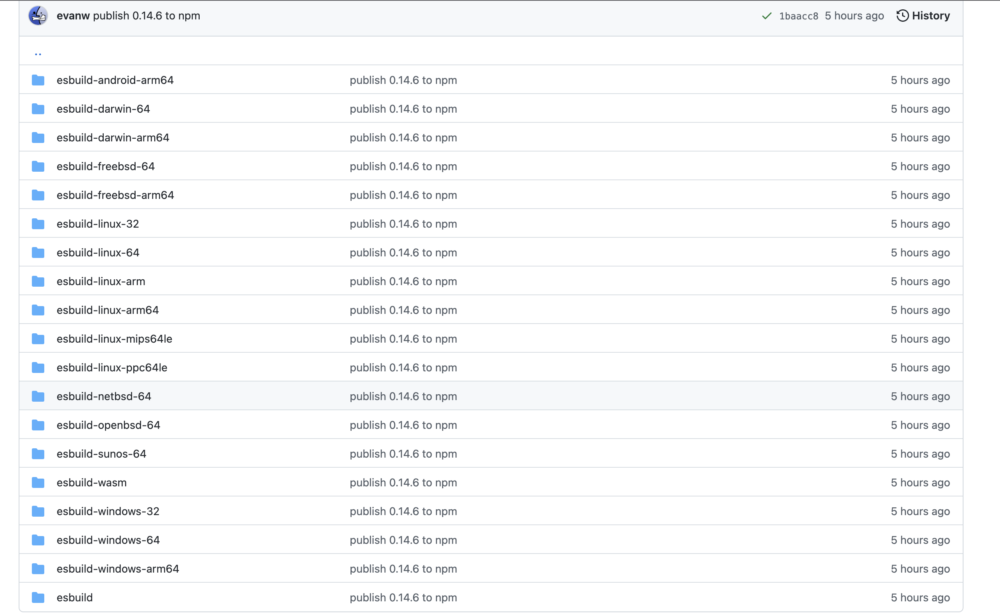
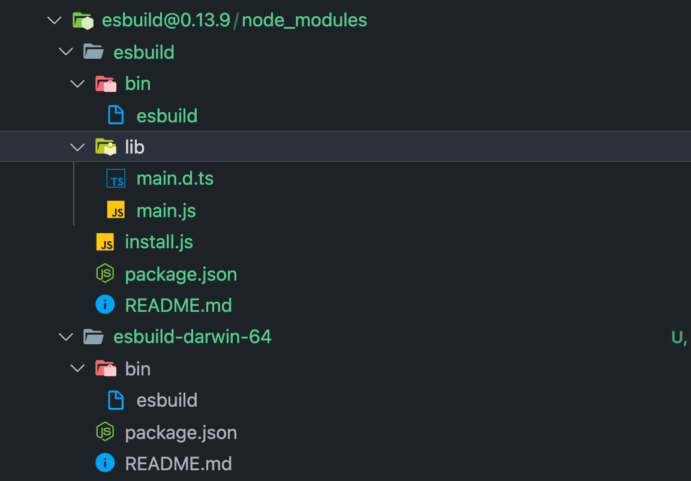

最近有想法做一个工具，工具的功能是`将JSON格式的文件转换为相应语言的类型`，比如说转成`ts`的`interface`或`type`、转成`go`的`struct`。名字叫做`json2type`，先贴一下工具的[Github](https://github.com/hubvue/json2type)和[Client](https://blog.cckim.cn/tools/json2type)。
于是为了提高代码执行效率便用go来写了，完成之后准备向同事推广一下，突然想到我们的工作本身是做前端的，大多数同事电脑上还没有安装`Go`，没有办法使用`go install`安装程序，一时间困扰了我。

突然想到，业内赫赫有名的`esbuild`也是用go写的，它是怎么使用npm安装的呢？于是决定调研一波。

## esbuild 是怎么发布到 npm 的
从esbuild的Github上发现，esbuild工程目录下有一个npm目录，内容如下：


可以看到npm目录下有一堆不同平台、不同系统的目录，内容都没什么差别，都是npm发布必要的一些文件: `package.json`、`README`等等。

为什么要区分平台呢？因为go在不同平台下编译的产物不同，例如在linux下编译的是二进制可执行文件（ELF），在windows下编译的是可以在windows平台运行的.exe文件。

esbuild源码太多，看的麻烦，我们可以使用npm安装esbuild，看下都安装了什么东西。


可以看到一共安装了两个包：`esbuild`和`esbuild-darwin-64`

没错，第二个包就是我的电脑系统所对应go项目的编译产物。打开`esbuild`的`package.json`可以看到scripts中有这么一个命令
```json
{
  "postinstall": "node install.js"
}
```
脚本表示在使用npm安装包完成后执行`install.js`这个文件，这个文件里有段代码已经表明了我们所探究的目标。
```js
async function downloadDirectlyFromNPM(pkg, subpath, binPath) {
  const url = `https://registry.npmjs.org/${pkg}/-/${pkg}-${"0.13.9"}.tgz`;
  console.error(`[esbuild] Trying to download ${JSON.stringify(url)}`);
  try {
    fs2.writeFileSync(binPath, extractFileFromTarGzip(await fetch(url), subpath));
    fs2.chmodSync(binPath, 493);
  } catch (e) {
    console.error(`[esbuild] Failed to download ${JSON.stringify(url)}: ${e && e.message || e}`);
    throw e;
  }
}
```
上面代码意思是将用户操作系统对应的可执行文件下载到bin目录下，然后通过`exec`去执行。

### 总结
总结一下`esbuild`发布到`npm`的思路：
1. 将Go项目编译出不同平台的可执行文件
2. 将可执行文件分别发布(npm或者其他托管平台)
3. 发布js程序到npm，在下载过程中检测用户操作系统，然后`fetch`对应平台的可执行文件
4. 使用`exec`执行

## 将Go项目发布到npm
有了`esbuild`的思路，实现也就简单了很多。

### Step1 编译
如果使用go自带编译工具`go build`编译的话，则只会编译本机操作系统相关的可执行文件，既然要发布，那么就应该适用于广大用户，因此单单使用`go build`编译是不可行的。

这里介绍一个工具[goreleaser](https://goreleaser.com/quick-start/)，`goreleaser`是go项目的发布自动化程序，可以编译产出go项目所有平台的可执行文件。

`goreleaser`的使用方式也比较简单，由于是用go编写的，可以用go安装。

```shell
go install github.com/goreleaser/goreleaser@latest
```

然后使用`goreleaser init`命令生成`.goreleaser.yml`文件，文件内容大致如下：
```yml
before:
  hooks:
    # You may remove this if you don't use go modules.
    - go mod tidy
    # you may remove this if you don't need go generate
    - go generate ./...
builds:
  - env:
      - CGO_ENABLED=0
    goos:
      - linux
      - windows
      - darwin
archives:
  - replacements:
      darwin: Darwin
      linux: Linux
      windows: Windows
      386: i386
      amd64: x86_64
checksum:
  name_template: 'checksums.txt'
snapshot:
  name_template: "{{ incpatch .Version }}-next"
changelog:
  sort: asc
  filters:
    exclude:
      - '^docs:'
      - '^test:'
```

最后使用`goreleaser release`命令就可以编译输出了
```shell
goreleaser release --skip-publish --rm-dist --skip-validate
```
- --skip-publish：忽略发布，goreleaser不只是编译程序，同样带有自动化发布功能
- --rm-dist：编译时删除dist目录，goreleaser默认会将编译产物放在dist目录下
- --skip-validate：编译时忽略版本校验

至此我们已经得到了各个平台的可执行文件。`goreleaser`其他参数详细信息可以看官网，

### Step2 fetch可执行文件
你可能会想，第二步不应该是将编译产物发布到托管平台么？是的没错，但是也可以不这么做。

回顾一下`esbuild`将编译产物发布到npm上，其实我们也可以将编译产物跟随js文件一起发布到npm上，相比`esbuild`这种方式在安装包过程中会慢许多，因为`esbuild`只需要fetch一个平台产物，而我们要fetch多个平台产物，但这种实现相对简单，也是一种方式。

先来看下我们的npm包工程目录：
```shell
|____dist
| |____json2type_linux_386
| | |____json2type
| |____json2type_windows_arm64
| | |____json2type.exe
| |____json2type_darwin_arm64
| | |____json2type
| |____json2type_linux_arm64
| | |____json2type
| |____json2type_windows_amd64
| | |____json2type.exe
| |____json2type_windows_386
| | |____json2type.exe
| |____json2type_linux_amd64
| | |____json2type
| |____json2type_darwin_amd64
| | |____json2type
|____node_modules
|____README.md
|____package-lock.json
|____package.json
|____lib
| |____postinstall.js
```
- dist目录下包含各个平台的编译产物
- lib下为js脚本
- 以及其他npm包所需文件

`package.json`中订阅了两个执行脚本
```json
{
  "postinstall": "node ./lib/postinstall.js install",
  "preuninstall": "node ./lib/postinstall.js uninstall"
}
```
分别在安装后、卸载前执行脚本。

那么来看下`postinstall.js`都做了什么事

```js

const actions = {
  install, //function
  uninstall //function
}

const run = async () => {
  try {
    const args = process.argv.slice(2)
    const cmd = args[0]
    if (!actions[cmd]) {
      console.log("Invalid command. `install` and `uninstall` are the only supported commands");
      process.exit(1);
    }
    await actions[cmd]()
    process.exit(0)
  } catch(err) {
    console.log(err)
    process.exit(1)
  }
}

run()
```
入口很简单，通过node执行脚本传入的参数来确定执行的action，我们先来看下install逻辑。
```js
const { resolve } = require('path')
const { exec } = require('child_process')

const BIN_PATH = '~/work/bin/'
const ARCH_MAPPING = {
  "ia32": "386",
  "x64": "amd64",
  "arm": "arm"
}

const install = async () => {
  try {
    const extname = process.platform === 'windows' ? '.exe' : ''
    const commandPath = resolve(__dirname, `../dist/json2type_${process.platform}_${ARCH_MAPPING[process.arch]}/json2type${extname}`)
    await execShellCommand(`cp ${commandPath} ${BIN_PATH}/json2type`)
    console.log('Install cli successfully!')
  } catch(err) {
    console.warn('Install fail: ', err)
  }
}

const execShellCommand = (cmd) => {
  return new Promise((resolve, reject) => {
    exec(cmd, (error, stdout, stderr) => {
      if (error) {
        reject(error)
      }
      resolve(stdout? stdout : stderr)
    })
  })
}

```
`install`函数做的事情是判断操作系统找到相对应的可执行文件，然后将可执行文件copy到`~/work/bin/`目录下，这个目录是干什么的呢？熟悉go的应该知道使用`go install`安装的命令都是放在这个目录下。

由于go项目只是全局命令的安装，因此只需要将可执行文件copy到`~/work/bin/`目录下即可，这一步也相当于`esbuild`的第4步。

如果你的项目是需要在js代码里调用，那么应该使用`exec`调可执行文件，然后将输出传给用户。

`uninstall`做的事情也比较简单，也就是卸载功能。
```js
const uninstall = async () => {
  try {
    await fs.unlink(`${BIN_PATH}/json2type`)
    console.log("Uninstall cli successfully!")
  } catch(err) {
    console.warn('Uninstall fail: ', err)
  }
}
```
需要卸载时只需要将`~/work/bin/`下的可执行文件删除即可。

### 总结
将go程序发布到npm实际上除了安装，还有实现使用js调用go，当然还有wasm方案，这种应该是成本最小的方案。通过这种思路，也可以得出当要去做一个其他语言做的项目的sdk时的方法。


